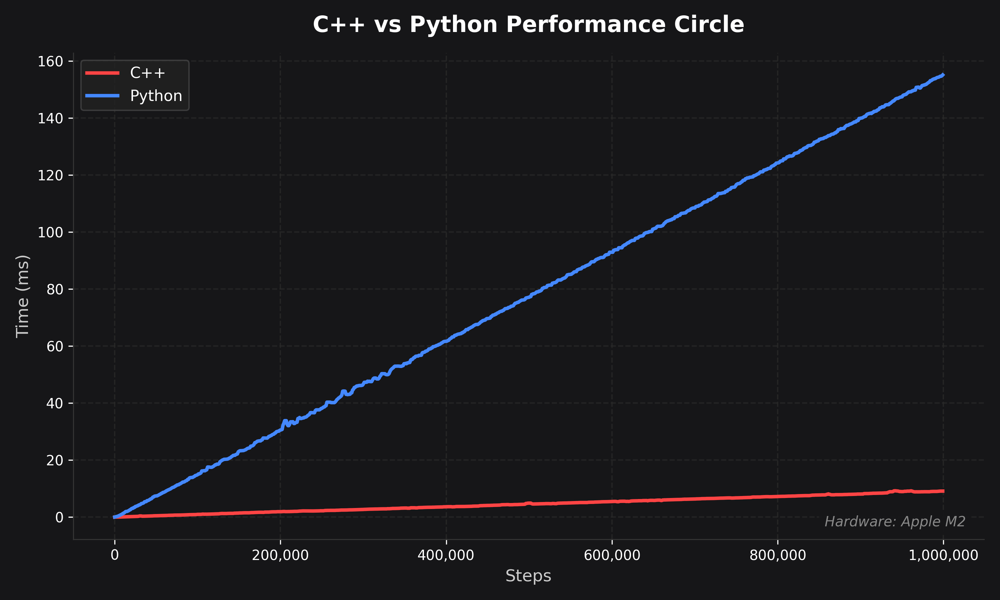
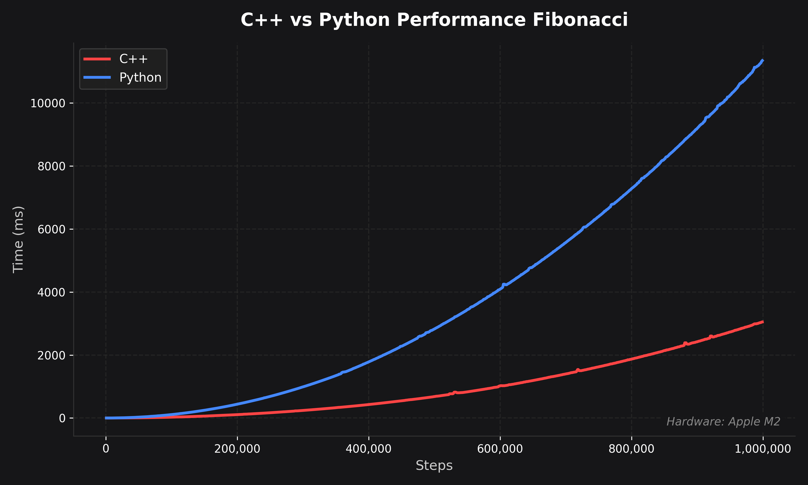
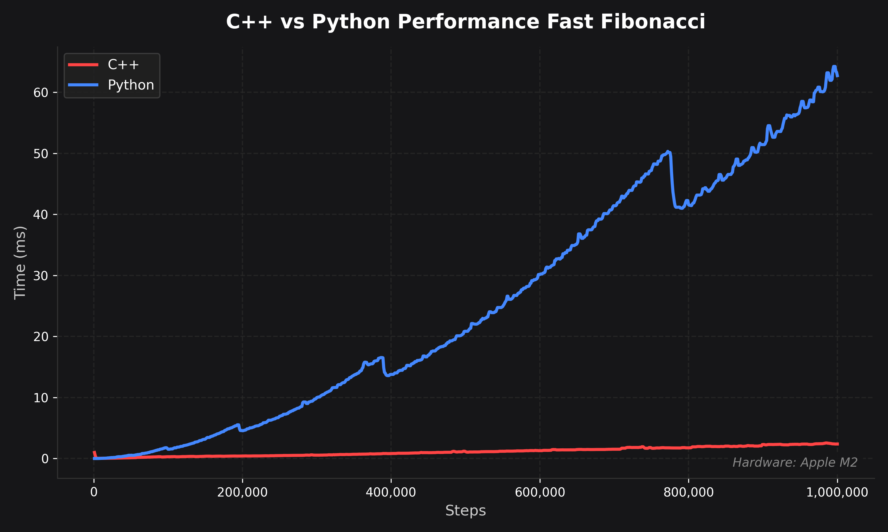

# High School Capstone

This is my Senior Capstone, aiming to measure the performance differences between C++ and Python across various algorithms. Specifically, it tests trigonometric functions through circle calculation, the naive Fibonacci sequence, and fast Fibonacci (fast doubling).


## Key findings

In all cases, C++ outperformed Python by a substantial margin. For algorithms like naive Fibonacci, C++ is the only viable solution as you scale. However, in other cases like fast Fibonacci, Python offers compelling speeds and may be the better choice, depending on whether the difference of a few milliseconds actually matters for your project.

### Results
---


*In this case, the algorithm is linear, resulting in a small performance difference at the start. As the numbers scale up, both languages remain relatively quick for non-performance-critical applications.*

---


*Since naive Fibonacci scales exponentially, C++ becomes the only viable option if you must use this specific algorithm, unless performance doesn't matter at all.*

---


*Fast Fibonacci is orders of magnitude quicker than the naive algorithm, making Python perfectly viable in situations where a few milliseconds don't count.*

## Dependencies

Before compiling or running the code make sure you have the following dependencies installed:

### C++
Fibonacci will cause overflow really quickly, therefore the code relies on the **GMP** (GNU Multiple Precision Arithmetic) library.

**macOS (Recommended)**
You can install this easily via Homebrew:
```bash
brew install gmp
```

### Python

You will need Python 3 installed, along with the following packages, which can be installed through the following command:
```bash
pip install matplotlib pandas
```

## How to run

### C++

>[!IMPORTANT]
>This project was developed and tested entirely on macOS. Depending on your compiler and environment, the C++ code may require modifications to compile successfully on Windows

First, compile the circle C++ using the following command:
```bash
clang++ -o circle circle.cpp
```

Then for the Fibonacci files, use the following command instead:
```bash 
clang++ -o fast_fibonacci fast_fibonacci.cpp -lgmp -lgmpxx
```

>[!NOTE]
>These files are intentionally compiled without optimization flags to stop dead-code elimination, ensuring we are actually measuring the performance of the function.

### Python
Python is easy and will run cross-platform. Just run (changing the file name as needed):
```bash
python3 circle.py
```